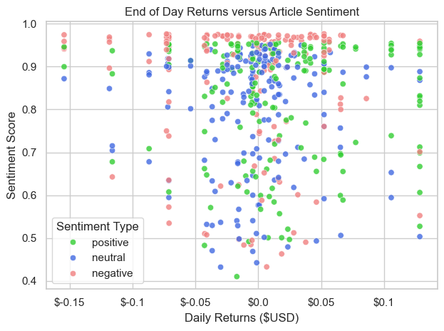
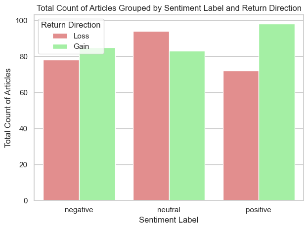
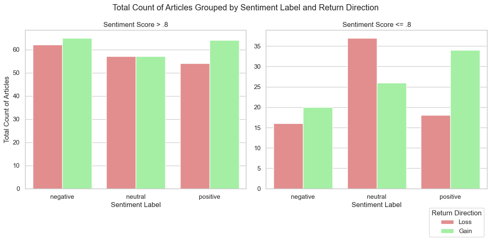

# Introduction
This project aims to analyze the effect market sentiment has on the direction of daily returns using sentiment analysis and logistic regression. 

# Data Acquisition and Pre-Processing 

The initial dataset for this project contains summaries for financial articles relating to the EV manufacturer Rivian from July 2024 through December 2024. Data was collected using the [Finnhub API](https://finnhub.io/). Historical finances used to calculate returns were pulled from Yahoo Fiannce using the [YFinance Package](https://ranaroussi.github.io/yfinance/index.html).

Several key adjustments were made prior to analysis:

- Articles published after market close (4pm ET) were shifted forward one day, as their sentiment would affect the following day's returns.
- Articles published over the weekend or on market holidays were assigned to the next open market day for similar reasons.
- Articles were limited to Yahoo Finance as they made up the majority of the data and other sources had frequent duplicates and irrelevant content.
- Log returns were calculated using the current day's and yesterday's closing price.

# Sentiment Analysis
Sentiment Analysis was performed on the article summaries using the pre-trained NLP model [FinBERT](https://huggingface.co/ProsusAI/finbert). Article summaries with more than 512 tokens were dropped from the dataset prior to analysis. Each summary was assigned a label (positive, negative, neutral) as well as a sentiment score ranging between 0 and 1. 

# Exploratory Data Analysis
An initial graph was created to visually assess where the sentiment scores were distributed with respect to returns. 

### Key Trends:
- Negative sentiment scores do not seem to strongly correlate to positive or negative returns.
- Positive sentiment scores tend to be associated with positive returns.
- As sentiment score increases, dispersion of returns around the mean appears to increase regardless of sentiment label.

To confirm what was observed in the scatterplot, a bar graph depicting total number of articles grouped by sentiment label was created and then grouped by whether the daily return was positive or negative.

### Takeaways:
- Confirms that negative sentiment is evenly distributed between positive and negative returns.
- Neutral sentiment is also fairly even, slightly skewed towards negative returns.
- Positive sentiment is the only sentiment with a notable difference, skewed towards positive returns as expected.

To look further into the greater variation in returns at higher sentiment scores, a bar graph similar to the one above but split by sentiment score was also created. 

### Takeaways:
- Lower sentiment scores appear to have a greater impact on the direction of returns for neutral and positive sentiments.
- The impact of negative sentiment appears to remain similar at lower sentiment scores.
- Identifies a possible interaction between sentiment score and sentiment label, indicating an interaction term may be useful when creating a model.
- Sample sizes between the two categories differ so these results should be taken with a grain of salt.

# Model Specification
Given whether returns are positive or negative is a binary outcome, a logistic regression model was chosen. By performing statistical inference on the coefficients for sentiment-related independent variables, we can determine the effect market sentiment has on return direction. 

### Dependent Variable:
- **Direction of Returns**: The direction of the log returns between today's closing price and yesterday's closing price. 1 is positive 0 is negative. 

### Independent Variables:
- **Direction of Overnight Returns:** the direction of the log returns between today's opening price and yesterday's closing price. 1 is positive 0 is negative. Serves as a point of comparison for effects of sentiment related variables. 
- **Dummy Variables for Sentiment Type:** Sentiment labels (positive, negative, neutral) were encoded as dummy variables, with neutral being dropped as the base category.
- **Sentiment Score:** Overall sentiment score not tied to any specific label.
- **Sentiment Score and Dummy Variable Interaction Terms:** Interaction terms between sentiment score and positive/negative sentiment labels were included to capture how the effect of sentiment type varies with sentiment score.

