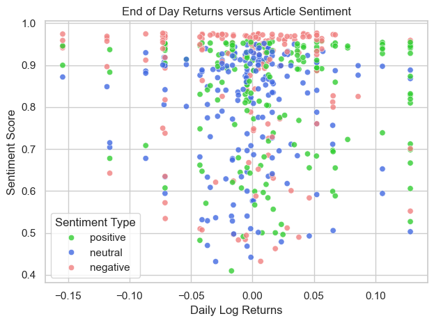

# Introduction
This project aims to analyze the effect intra-day market sentiment has on the direction of daily returns using sentiment analysis and logistic regression. Summaries for over 500 articles relating to the electric vehicle manufacturer Rivian were colleceted and analyzed. 

# Key Findings
- The effect of intra-day sentiment on market direction is marginal but statistically significant. In this case intra-day sentiment likely does not serve as a valuable feature in forecasting. 
- Intra-day negative sentiment does not have a significant impact on market direction.
- Higher overall sentiment score regardless of type increases likelihood of positive returns. This supports the idea that "all publicity is good publicity".
- Higher sentiment score for positive articles appears to diminish the impact of the article being positive.

# Data Acquisition and Pre-Processing 

The initial dataset for this project contains summaries for financial articles relating to the EV manufacturer Rivian from July 2024 through December 2024. Data was collected using the [Finnhub API](https://finnhub.io/). Historical finances used to calculate returns were pulled from Yahoo Fiannce using the [YFinance Package](https://ranaroussi.github.io/yfinance/index.html).

Several key adjustments were made prior to analysis:

- Articles published after market close (4pm ET) were shifted forward one day, as their sentiment would affect the following day's returns.
- Articles published over the weekend or on market holidays were assigned to the next open market day for similar reasons.
- Articles were limited to Yahoo Finance as they made up the majority of the data and other sources had frequent duplicates and irrelevant content.
- Log returns were calculated using the current day's and yesterday's closing price.

# Sentiment Analysis
Sentiment Analysis was performed on the article summaries using the pre-trained NLP model [FinBERT](https://huggingface.co/ProsusAI/finbert). Article summaries with more than 512 tokens were dropped from the dataset prior to analysis. Each summary was assigned a label (positive, negative, neutral) as well as a sentiment score ranging between 0 and 1. 

# Exploratory Data Analysis
An initial graph was created to visually assess where the sentiment scores were distributed with respect to returns. 

### Takeaways:
- Negative sentiment scores do not seem to strongly correlate to positive or negative returns.
- Positive sentiment scores tend to be associated with positive returns.
- As sentiment score increases, dispersion of returns around the mean appears to increase regardless of sentiment label.

To confirm what was observed in the scatterplot, a bar graph depicting total number of articles grouped by sentiment label was created and then grouped by whether the daily return was positive or negative.

### Takeaways:
- Confirms that negative sentiment is evenly distributed between positive and negative returns.
- Neutral sentiment is also fairly even, slightly skewed towards negative returns.
- Positive sentiment is the only sentiment with a notable difference, skewed towards positive returns as expected.

To look further into the greater variation in returns at higher sentiment scores, a bar graph similar to the one above but split by sentiment score was also created. 

### Takeaways:
- Lower sentiment scores appear to have a greater impact on the direction of returns for neutral and positive sentiments.
- The impact of negative sentiment appears to remain similar at lower sentiment scores.
- Identifies a possible interaction between sentiment score and sentiment label, indicating an interaction term may be useful when creating a model.
- Sample sizes between the two categories differ so these results should be taken with a grain of salt.

# Model Specification
Given whether returns are positive or negative is a binary outcome, a **logistic regression** model was chosen. By performing statistical inference on the coefficients for sentiment-related independent variables, we can determine the effect market sentiment has on return direction. 

### Dependent Variable:
- **Direction of Returns**: The direction of the log returns between today's closing price and yesterday's closing price. 1 is positive 0 is negative. 

### Independent Variables:
- **Direction of Overnight Returns:** the direction of the log returns between today's opening price and yesterday's closing price. 1 is positive 0 is negative. Serves as a point of comparison for effects of sentiment related variables. 
- **Dummy Variables for Sentiment Type:** Sentiment labels (positive, negative, neutral) were encoded as dummy variables, with neutral being dropped as the base category.
- **Sentiment Score:** Overall sentiment score not tied to any specific label.
- **Sentiment Score and Dummy Variable Interaction Terms:** Interaction terms between sentiment score and positive/negative sentiment labels were included to capture how the effect of sentiment type varies with sentiment score.

## Assumption Checking
The logistic regression model operates on several key assumptions that can be tested empirically. 
- **Large Sample Size:** Logistic regression requires a large sample size, with the general rule of thumb being at least 500. The dataset consists of 510 articles so this is covered. 
- **Independence of Observations:** Logistic regression requires that observations be independent of one another.
  - Given historical returns are considered time series data, the data itself must be stationary (constnat in mean and variance over time) for the observations to be considered independent. The return data was assessed visually and an Augmented Dickey-Fuller test was performed to confirm the data is stationary.
  - The way the dataset is structured, multiple articles are assigned to one date and therefore one return. This violates the independence assumption but can be partially overcome by using clustered standard errors. Clustering standard errors by date ensures that statistical significance of the coefficients is accurate.
- **Linearity of Independent Variables and Log Odds:** Continuous independent variables should have a linear relationship with the log odds of the dependent variables
  - A Box-Tidwell test was performed to assess this, and found that the interaction term between the positive sentiment dummy variable and sentiment score bordered on non-linearity. This finding indicates a polynomial term may be useful in the model.

## Model Results and Statistical Inference:

- **Negative Sentiment is Statistically Insignificant:** This confirms our finding in EDA that negative sentiment does not contribute to return direction.
- **Sentiment  Score is Statistically Significant and Positive:** This indicates that more overall sentiment regardless of type increases the likelihood that returns will be positive.
- **Positive Sentiment Score Interaction is Statistically Significant and Negative:** This confirms our finding in EDA that higher sentiment score diminishes the effects of positive sentiment.
- **Low Log Likelihood and Pseudo R-Squared:** Indicates that much of the phenomenon remains unexplained. The effects of sentiment are marginal, even if they are statistically significant.

Further models with polynomial terms for the positive sentiment score interaction term were tested, but did not meaningfully improve model metrics and dramatically increased coefficient estimates indicating overfitting. 

# Limitations and Further Research
- Although clustered standard errors corrects for the lack of independence in the errors, the magnitude of the coefficient estimates are likely still off. This could be corrected by aggregating sentiment by day, although more than one year of data would be needed given the sample size requirements for logistic regression. Finnhub limits access to one year of company news.
- Using the content of articles rather than article summaries may provide a more accurate measure of sentiment. This would require an NLP model that can handle more tokens, as well as access to the contents for the articles pulled. 
- It would be interesting to repeat this experiment for other stocks across other industries to see if the findings hold true. Perhaps different industries react differently to market sentiment. 

